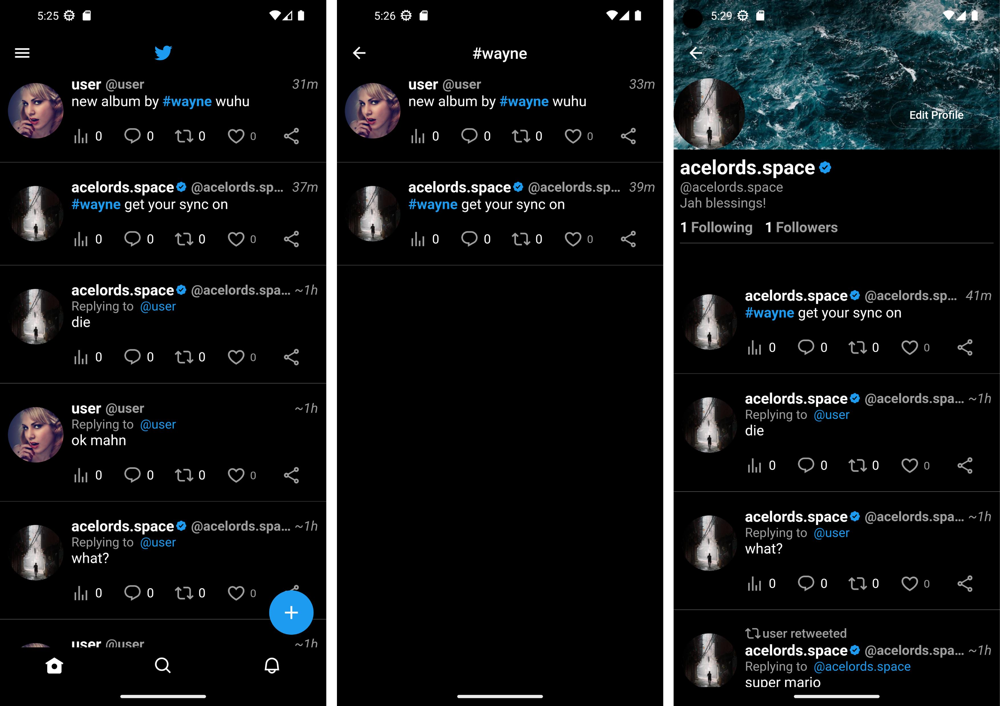

# twitter_clone - A Demo App using AppWrite Realtime (Cloud / Self-Hosted)

a Twitter clone built with AppWrite backend and Flutter Mobile App, using Riverpod State Management.

>NB: Don't spam the backend! I would hate for my bill to go up, thereby forcing me to shut down the Demo server!

## Getting Started

This project is a starting point for a Flutter application.

A few resources to get you started if this is your first Flutter project:

- [Lab: Write your first Flutter app](https://docs.flutter.dev/get-started/codelab)
- [Cookbook: Useful Flutter samples](https://docs.flutter.dev/cookbook)

For help getting started with Flutter development, view the
[online documentation](https://docs.flutter.dev/), which offers tutorials,
samples, guidance on mobile development, and a full API reference.
